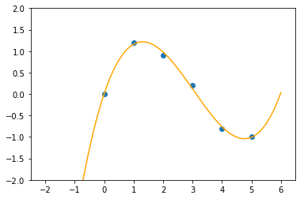

## 题目一

```python
import torch
import numpy as np
import matplotlib.pyplot as plt
xs = torch.load('data/xs.pt').numpy()
ys = torch.load('data/ys.pt').numpy()
for i in range(len(xs)):
    print('(', xs[i],',', ys[i], ')', end=' ')
coefficients = np.polyfit(xs, ys, 3)
func = np.poly1d(coefficients)
x = np.linspace(-2,6,1000)
y = func(x)
plt.xlim(-2.5,6.5)
plt.ylim(-2.0,2.0)
plt.xticks(np.linspace(-2,6,9))
plt.yticks(np.linspace(-2.0,2.0,9))
plt.plot(x,y,color='orange')
plt.scatter(xs,ys)
plt.show()
```

    ( 0.0 , 0.0 ) ( 1.0 , 1.2 ) ( 2.0 , 0.9 ) ( 3.0 , 0.2 ) ( 4.0 , -0.8 ) ( 5.0 , -1.0 ) 




## 题目二

```python
import torch
tsr = torch.Tensor([i for i in range(10,50)])
print(tsr, '\n', torch.max(tsr), '\n', torch.min(tsr))
```

    tensor([10., 11., 12., 13., 14., 15., 16., 17., 18., 19., 20., 21., 22., 23.,
            24., 25., 26., 27., 28., 29., 30., 31., 32., 33., 34., 35., 36., 37.,
            38., 39., 40., 41., 42., 43., 44., 45., 46., 47., 48., 49.]) 
     tensor(49.) 
     tensor(10.)

## 题目三

```python
import torch
import numpy as np
def Convolution(matrix1, matrix2):
    res = np.zeros((5,5))
    for i in range(5):
        for j in range(5):
            matrix1_sub = matrix1[i:i+3,j:j+3]
            res[i][j] = np.sum(matrix1_sub * matrix2)
    return res

def main():
    mtx1 = np.array([[0,0,0,0,0,0,0],[0,1,0,1,2,1,0],[0,0,2,1,0,1,0],[0,1,1,0,2,0,0],[0,2,2,1,1,0,0],[0,2,0,1,2,0,0],[0,0,0,0,0,0,0]])
    mtx2 = np.array([[0,0,0,0,0,0,0],[0,2,0,2,1,1,0],[0,0,1,0,0,2,0],[0,1,0,0,2,1,0],[0,1,1,2,1,0,0],[0,1,0,1,1,1,0],[0,0,0,0,0,0,0]])
    mtx1_mul = np.array([[1,0,1],[-1,1,0],[0,-1,0]])
    mtx2_mul = np.array([[-1,0,1],[0,0,1],[1,1,1]])
    res = Convolution(mtx1, mtx1_mul) + Convolution(mtx2, mtx2_mul)
    print(res)
if __name__ == '__main__':
    main()
```

    [[ 2.  0.  2.  4.  0.]
     [ 1.  4.  4.  3.  5.]
     [ 4.  3.  5.  9. -1.]
     [ 3.  4.  6.  2.  1.]
     [ 5.  3.  5.  1. -2.]]


